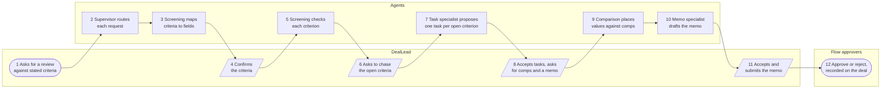

# A DealLead takes a deal from screening to an approved decision through agents

## Summary

Phase 1b builds only the agentic foundation that deal review needs, so the experience PODs can build later agents on it. In the POC, one supervisor runs four kinds of specialist on one deal across three pillars: screening (Pipeline), comparison with comps (Analysis), and follow-up tasks and a decision memo with approval (Audit and Decisions). The handoffs between them test the routing, guardrails, evals, tools and cost tracking every Dealpath agent runs on.

## Who Is Affected

| Who | What they are trying to get done | What gets in the way today |
|---|---|---|
| A DealLead or an Analyst | Screen a deal, check it against comps, and get a sourced decision approved | Screening is manual. The MCP beta answers questions, but keeps no record and writes directly when called |
| An experience POD product manager | Ship an agent for their domain without solving routing, safety and quality again | Neuro has no shared foundation. One seed agent answers every request |
| An AI Platform Builder | Build the foundation once, against a real experience | A plan covering every agent at once is too large to prove |
| Security and compliance | Know what an agent did, for whom, under whose authority | No session record exists. A Neuro agent acts with its caller's full authority |

## Experiences in Scope

| Experience | Outcomes | In scope |
|---|---|---|
| [Deal review (POC)](../deal-screening/00-deal-screening.md) | CO-4, CO-5, CO-7, CO-10, FO-1, FO-2, FO-5, FO-9 | UX1, UX2 and UX4 to UX7, on deal and comp fields. UX3 joins with D11. Frances Lo owns it, and Shalin Gosalia drafts it for the POC |

Each step belongs to a pillar and its POD: screening to Connect & Pipeline (Frances Lo), comparison to Deal & Portfolio (its incoming PM), and tasks, memo and approval to Workflow & Collaboration (Henderson Beck). The task and memo specialists are POC stand-ins for the agents Henderson Beck is specifying.

## Agent Workflow

*One deal review in the POC, read left to right in step order. Key: each lane is a person or the agents, a rounded box starts or ends the run, a slanted box is a point where the DealLead acts, and a rectangle is an agent's step. The supervisor routes every request, and only its first routing is drawn.*

| Who | Does | How | Outcome |
|---|---|---|---|
| DealLead | Asks, confirms and accepts | Explicitly, each time the run parks for them | Nothing changes on the deal except what the DealLead accepts |
| Supervisor | Routes | Within both the DealLead's authority and its own, under the bounds in deal screening's `05` | One session recording who acted, which version, its cost and its outcome |
| Screening specialist | Checks | Per criterion, citing each value's field | Pass, fail or unknown per criterion, never an estimate |
| Task specialist | Proposes | Once per open criterion, as a proposal | A proposed task with an assignee or none, due three business days later |
| Comparison specialist | Compares | Against at least three of the Tenant's comps | Price, cap rate and price per unit against the comps' range, flagged when outside it |
| Memo specialist | Drafts | Only from values the session already sourced | One memo proposal |
| Flow approvers | Decide | In Flow, never through an agent | An approved or rejected memo, with who decided on which evidence recorded on the deal |

## Foundation by Layer

| Layer | What the POC needs | How the POC tests it | Stack and requirements |
|---|---|---|---|
| Orchestration | Route each request to the right specialist, hand results between them, park for the DealLead, record each step, and stop at any bound | Handoffs in UX5 to UX7, and a run stopped at each bound | [`agentic/`](../../agentic/agentic/00-agentic.md) A1–A4, A6, A9, A10, A14 |
| Agent registry | Declare the specialists, versioned, so a session records which version acted | A session record naming each specialist's version | [`agentic/`](../../agentic/agentic/00-agentic.md) A2, A21 |
| Guardrails | An agent acts within both the User's authority and its own. Every write is a proposal, keyed per act. One kill switch per Tenant | Eval cases 6, 8 and 9, and the kill switch stopping a running session | [`agentic/`](../../agentic/agentic/00-agentic.md) A5, A11, A27; the kill switch is an Extend, as deal screening's DSN4 requests |
| Proposals | Tasks and the memo are proposals the DealLead accepts | Eval cases 7, 8 and 13 | [`agentic/`](../../agentic/agentic/00-agentic.md); Extends, as deal review's [`04`](../deal-screening/04-proposed-model.md) DS11, DS13 and DS19 request |
| Human approval and audit | A submitted memo goes to Flow's approvers, and the deal records who decided on which evidence | UX7, and DSN5 | [`flow/`](../../coreservices/flow/00-flow.md) §Approvals; [`agentic/`](../../agentic/agentic/00-agentic.md) A18 |
| Evals | A harness in CI, with the experience's cases and a scorer for unsupported values | Every case runs in CI | [`agentic/`](../../agentic/agentic/00-agentic.md) A22, A23 |
| Tools and data | Tools derived from Neuro operations, field discovery, comp reads, and saving the memo as a file | Eval cases 1 to 3, 10 and 11 | [`mcp/`](../mcp/00-mcp.md), [`entity-fields/`](../../coredata/entity-fields/18-agent-metadata.md), [`documents/`](../../coreservices/documents/00-documents.md) D1, D16 |
| Experience | A view section for the per-criterion verdict | UX1's verdict in the agent panel | [`views/`](../views/00-views.md); an Extend, as deal screening's DS9 requests |
| Observability | Cost per session against the Solution Profile caps | Each session's cost recorded at its end | [`agentic/`](../../agentic/agentic/00-agentic.md) A9, N3 |

The four specialists cover four kinds of agent: one reads and classifies, one compares numbers, one proposes actions, and one drafts a document for approval. The task specialist follows the [tool evidence](../evidence/mcp-tools-to-outcomes.md): task reads are the MCP beta's most-used tools, though one account's automated traffic produces most of that volume.

## Out of Scope

1. **Other agents.** They follow once the POC shows the foundation works.
2. **Agents assembled from the current MCP tools.** The experience draws on the [tool evidence](../evidence/mcp-tools-to-outcomes.md). No `dealpath/mcp` code is reused.
3. **Tenant-facing agent configuration, standing triggers and autonomous writes.** Not in Phase 1b: each needs the foundation the POC tests first.
4. **Document reads and UX3.** They join once agent document reads are built.
5. **Underwriting and financial models.** The comparison uses deal and comp fields only.

## Appetite

The POC is worth six weeks, from Monday 2026-10-12 to Friday 2026-11-20, as proposed in Decisions Owed. If it runs over, UX4 in Claude is cut first. Routing the memo to approval is cut next, and the memo is still saved. Task creation is cut last, which leaves the task specialist read-only. The comparison stays: it is the POC's only Analysis coverage.

## Success Measures

| Measure | Today | Target | How it is measured |
|---|---|---|---|
| The experience passes its POC eval cases | No harness in Neuro | Cases 1 to 3 and 6 to 13 pass in CI before release | Eval harness over the experience's cases |
| Agent writes without an accepted proposal | Not recorded | Zero | Proposal activity joined to each write |
| Sessions with a complete record of who, what, which version, cost and outcome | None | Every session | Session and activity rows |
| The kill switch stops a running session | No kill switch | Tested in a demo Tenant before any client Tenant | A session ended by the switch, and its terminal activity |
| Progress on CO-4, CO-5, CO-7 and CO-10 | Step 2: clients use raw tools | Step 3: an agent on Neuro does the job | Progress column in the [outcome register](../outcomes.md) |

## Rollout

1. **A flag for the experience,** in `@neuro/flags`, off by default.
2. **First Tenants** as proposed in Decisions Owed.
3. **A kill switch per Tenant** stops every agent in that Tenant at once.
4. **Before a client Tenant,** support has a help article for the experience and the release notes name its limits.

## Decisions Owed

The POC starts on the proposed answers below, without waiting for an owner's sign-off. An owner changes an answer by pull request, and the change reaches the next story.

| Decision | Proposed answer | Owner | Needed by |
|---|---|---|---|
| Is deal screening in the POC, owned by Connect & Pipeline with AI Platform as secondary? | Yes | Frances Lo | 2026-10-09 |
| Does Shalin Gosalia draft deal screening for the POC while Frances Lo refines it? | Yes. Frances Lo stays primary owner, and her sign-off moves the stack past `proposed` | Frances Lo | 2026-10-09 |
| What does deal screening read in the POC? | The deal's fields only. Document reads and UX3 follow once agent document reads are built | Frances Lo | 2026-10-09 |
| Is UX4 in Claude in the POC? | Yes, and the first cut if the POC runs over | Frances Lo, Shalin Gosalia | 2026-10-09 |
| Do task and memo specialists inside deal review stand in for Henderson Beck's agents during the POC? | Yes. His agents replace them as their own experiences, and he writes eval cases 7 to 9, 12 and 13 until then | Henderson Beck, Frances Lo | 2026-10-09 |
| What is a proposed task's due date? | Three business days after the request | Frances Lo, Henderson Beck | 2026-10-16 |
| Where do screening criteria come from? | Stated per request | Frances Lo | 2026-10-09 |
| Which model provider receives the deal's data? | Claude through AWS Bedrock | Shalin Gosalia, Kenter Wu | 2026-10-09 |
| What are a screening run's bounds? | The values in deal screening's `05` | Frances Lo, Shalin Gosalia | 2026-10-16 |
| Does the handoff run in the screening's session, with time parked for the DealLead excluded from the wall clock? | Yes | Shalin Gosalia, Kenter Wu | 2026-10-09 |
| Who builds the task and memo proposals and the `follow-up` competence (DS11, DS13, DS19)? | AI Platform, through the Agentic initiative | Kenter Wu, John Lorance | 2026-10-09 |
| Who builds the verdict view section (DS9)? | `GRO:View Engine Close-out`, before the POC's last two weeks | Kenter Wu, Frances Lo | 2026-10-16 |
| Who owns the comparison step and writes eval cases 10 and 11? | Deal & Portfolio's incoming PM, with Shalin Gosalia until they start | Jeff Blasbalg | 2026-10-16 |
| Which approvers does the memo go to in the demo Tenants? | The DealLead's manager, as one approver | Frances Lo, Henderson Beck | 2026-10-16 |
| Is Mastra storage for durable parking (A10) configured in the POC's first week? | Yes, by 2026-10-16 | Kenter Wu, John Lorance | 2026-10-09 |
| Who builds the per-Tenant kill switch? | AI Platform, through the Agentic initiative, before the first client Tenant | Kenter Wu, John Lorance | 2026-10-16 |
| Who builds agent document reads (D11 text, under D10 listing)? | `GRO:Document Search and Agent Access`, before deal screening reads documents | Kenter Wu, John Lorance | 2026-10-16 |
| Who owns the `agentic/` stack and the Agent Tool Surface parts of `mcp/`? | AI Platform as product owner, with John Lorance's team as engineering owner | Kenter Wu, John Lorance | 2026-10-09 |
| Do the outcome register and its Progress column match the Vision Plan slides? | Signed off as drafted, or corrected by pull request | Ursula Sage, Jeff Blasbalg | 2026-10-16 |
| Which are the three to four experience PODs, and who is each POD's product manager? | Listed in [decision rights](../decision-rights.md) | Ursula Sage, Jeff Blasbalg | 2026-10-16 |
| Has each POD owner validated their column of the decision-rights matrix? | Each confirms or corrects their column by pull request | Frances Lo, Henderson Beck | 2026-10-16 |
| How long is the POC worth? | Six weeks, 2026-10-12 to 2026-11-20, cutting UX4, then memo approval, then task creation | Kenter Wu, Shalin Gosalia | 2026-10-09 |
| Which Tenants get the POC first? | The demo Tenants, then one design-partner client | Shalin Gosalia | 2026-10-16 |
| When does the POC start? | Monday 2026-10-12, with Builders assigned by 2026-10-09 | Kenter Wu, Shalin Gosalia | 2026-10-09 |

## Sources

1. Ground Up Vision Plan, September 2026: the client outcomes and the human-in-the-loop rules.
2. GroundUp POD strategy, October 2026 draft: the decision-rights matrix.
3. GroundUp chat, 2026-10-05: focus the POC on two to three experiences (John Lorance, Kenter Wu), and reuse no existing MCP code in Neuro (Kenter Wu).
4. Shalin Gosalia's first draft of this brief, pull request #1399.
