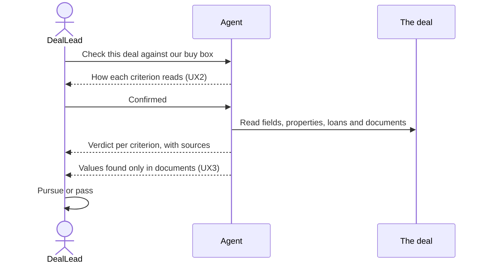
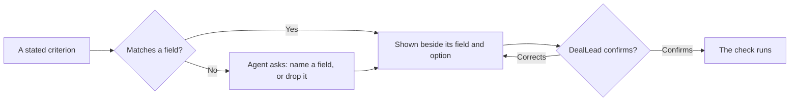
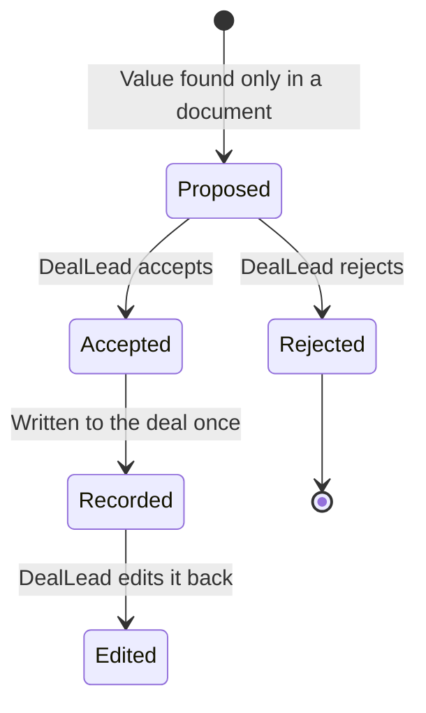
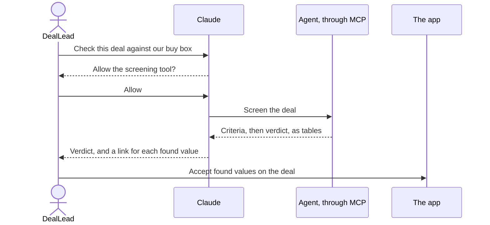
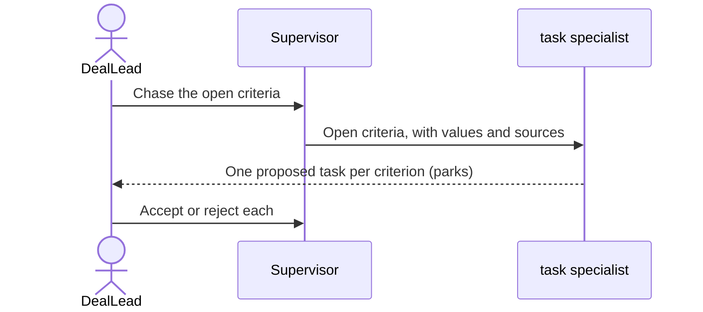
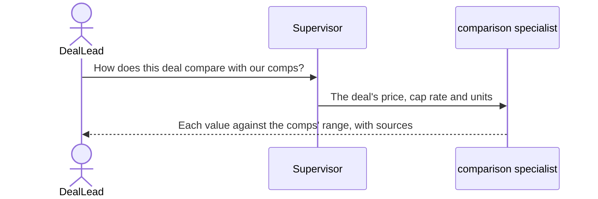
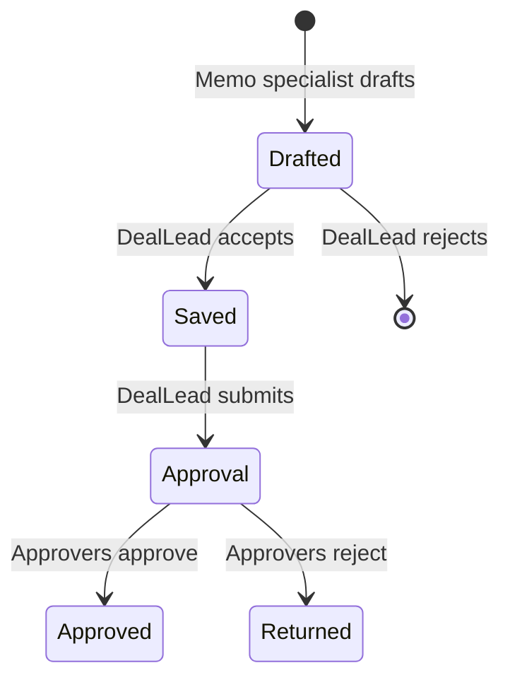

# Design and UX

Deal review takes a deal from screening to an approved decision, across seven User experiences. The agents read, compare, propose and draft, and the DealLead decides.

## UX1: Screen a New Deal

The DealLead starts it in the agent panel on a deal.

*Screening a deal. Key: a solid arrow is a request or read, a dashed arrow shows the DealLead something.*

1. The DealLead asks: "Check this deal against our buy box: multifamily, Sun Belt, $20–60M, going-in cap rate above 5.5%."
2. The DealLead confirms the criteria, as UX2 (critical).
3. The agent reads the deal, its properties and loans, and its documents (agent, unseen).
4. The agent returns pass, fail or unknown per criterion, with value and source (agent, critical).
5. Values found only in documents go to UX3 (agent).

| What the User sees | Shown by |
|---|---|
| The verdict table in the `00` Outputs, each source linked | A view in the agent's answer, from [`views/`](../views/00-views.md) |

| When | What the User sees | What they can do |
|---|---|---|
| No field or document states a value | Unknown | Enter it and screen again |
| The User cannot read the field | Unknown, as on the deal page | Ask someone who can |
| A document tells the agent to change the deal | Nothing changes, and the verdict notes the ignored instruction | Nothing further |
| The run reaches a bound | The criteria checked so far | Screen the rest |

## UX2: Confirm the Criteria

The agent starts it inside UX1, before it checks anything.

*Confirming criteria. Key: a diamond is a question, a box a result or next step.*

1. The agent lists each criterion beside its field and option (agent, critical).
2. For a criterion with no field, it asks the DealLead to name one or drop it (agent).
3. The DealLead confirms or corrects (decides).

| What the User sees | Shown by |
|---|---|
| Each criterion beside its field and option | A view in the agent's answer |

| When | What the User sees | What they can do |
|---|---|---|
| No field matches | "No field matches 'IRR hurdle'. Drop it, or name one?" | Name a field, or drop it |

## UX3: Review Found Values

The agent starts it at the end of UX1, on the deal.

*One found value. Key: a box is a state, an arrow names who moves it.*

1. The agent proposes each document-only value, one field at a time (agent).
2. The DealLead accepts or rejects each (decides). An accepted value is recorded once.

| What the User sees | Shown by |
|---|---|
| The field, current and proposed value, source, Accept and Reject | The proposal card |

## UX4: Screen From Claude

The DealLead starts it in Claude, through the Neuro MCP connector.

*Screening from Claude. Key: a solid arrow is a request, a dashed arrow a reply.*

1. The DealLead asks Claude to check a deal against stated criteria.
2. Claude asks the DealLead before each tool call (decides).
3. The agent confirms the criteria and returns the verdict as tables, as in UX2 and UX1 (agent).
4. Each proposal links to the deal, to accept in the app.

| When | What the User sees | What they can do |
|---|---|---|
| A proposal is accepted in Claude | A link to the deal | Accept it in the app |

## UX5: Chase Open Criteria

The DealLead starts it in the agent panel after a screening.

*Chasing open criteria. Key: as UX4. The session parks where marked.*

1. The supervisor passes each Fail or Unknown criterion to the task specialist (agent).
2. It proposes one task each, with an assignee or none, and a due date (agent).
3. The DealLead accepts or rejects each. Accepting creates the task (decides, critical).

| What the User sees | What shows it |
|---|---|
| Proposed tasks: title, assignee, due date and criterion | The agent's answer, then a proposal card per task |

| When | What the User sees | What they can do |
|---|---|---|
| No deal team member fits | The task, with no assignee | Assign it in the task list |

## UX6: Compare With Comps

The DealLead starts it in the agent panel after a screening.

*Comparing with comps. Key: as UX4.*

1. The comparison specialist reads the Tenant's comps for the deal's market and property type (agent, unseen).
2. It shows price, cap rate and price per unit against the comps' range, flagging values outside it (agent, critical).

| What the User sees | Shown by |
|---|---|
| Each value, the comps' low, median and high, and the comps used | A view in the agent's answer |

| When | What the User sees | What they can do |
|---|---|---|
| Fewer than three comps match | "Too few comps to compare", and no flags | Widen the market, or add comps |

## UX7: Decide and Record

The DealLead starts it when ready to decide, and the Tenant's approvers finish it.

*One decision memo. Key: as UX3.*

1. The memo specialist drafts a memo from the verdict, comparison and tasks, quoting only sourced values (agent, critical).
2. The DealLead accepts it, saving it as a file on the deal, then submits it for approval (decides).
3. The approvers decide, and the deal records who decided on which memo (decides, critical).

| What the User sees | Shown by |
|---|---|
| The draft memo, each figure linked to its source | The proposal card |
| The approval and its decision | Flow's approval on the deal |

Prototypes: none yet.

Sources: Shalin Gosalia's deal screening draft in pull request #1399, the MCP beta's field-mapping defects, and [`flow/05-work-items.md`](../../coreservices/flow/05-work-items.md) §Approvals.
