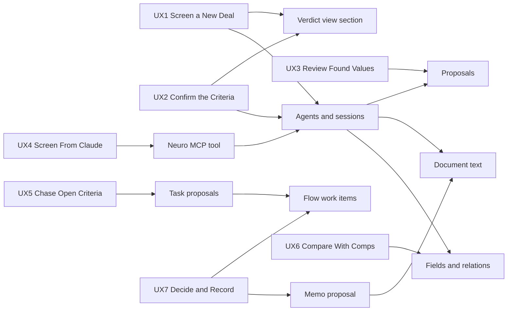

# Proposed Model

Deal review configures entity-fields, documents, flow and mcp. It extends views for a verdict section, and agentic for follow-up tasks, memo proposals and a kill switch.

## Components at a Glance

*Each User experience on the left, and the stack component it uses. Key: an arrow means "uses". The verdict view section, task proposals and memo proposals are the Extends; every other component is configured as it stands.*

## Composition

| Requirement | User experience | Owner | Use | Owner's requirement |
|---|---|---|---|---|
| DS1 | UX2 | [`entity-fields/`](../../coredata/entity-fields/00-entity-fields.md) | Configure | §The renderer: one place the model's picture comes from |
| DS2 | UX1 | [`agentic/`](../../agentic/agentic/00-agentic.md) | Configure | A3, A5 |
| DS3 | UX1 | [`entity-fields/`](../../coredata/entity-fields/00-entity-fields.md) | Configure | §Reading and reporting |
| DS4 | UX1 | [`documents/`](../../coreservices/documents/00-documents.md) | Configure | D10, D11, D16 |
| DS5 | UX1 | [`entity-fields/`](../../coredata/entity-fields/00-entity-fields.md) | Configure | §The read operations |
| DS6 | UX3 | [`agentic/`](../../agentic/agentic/00-agentic.md) | Configure | A11, A12 |
| DS7 | UX3 | [`entity-fields/`](../../coredata/entity-fields/00-entity-fields.md) | Configure | §Proposals: review-gated writes |
| DS8 | UX3 | [`agentic/`](../../agentic/agentic/00-agentic.md) | Configure | A1 |
| DS9 | UX1, UX2 | [`views/`](../views/00-views.md) | Extend | — |
| DS10 | UX4 | [`mcp/`](../mcp/00-mcp.md) | Configure | §What the surface is |
| DS11 | UX5 | [`agentic/`](../../agentic/agentic/00-agentic.md) | Extend | — |
| DS12 | UX5 | [`flow/`](../../coreservices/flow/00-flow.md) | Configure | §Assignment: the axis that makes agents fit |
| DS13 | UX5 | [`agentic/`](../../agentic/agentic/00-agentic.md) | Extend | — |
| DS14 | UX5 | [`agentic/`](../../agentic/agentic/00-agentic.md) | Configure | A27 |
| DS15 | UX6 | [`entity-fields/`](../../coredata/entity-fields/00-entity-fields.md) | Configure | §The read operations |
| DS16 | UX6 | [`agentic/`](../../agentic/agentic/00-agentic.md) | Configure | A1, A3 |
| DS17 | UX6 | [`entity-fields/`](../../coredata/entity-fields/00-entity-fields.md) | Configure | §The read operations |
| DS18 | UX7 | [`agentic/`](../../agentic/agentic/00-agentic.md) | Configure | A1, A3 |
| DS19 | UX7 | [`agentic/`](../../agentic/agentic/00-agentic.md) | Extend | — |
| DS20 | UX7 | [`documents/`](../../coreservices/documents/00-documents.md) | Configure | D1, D16 |
| DS21 | UX7 | [`flow/`](../../coreservices/flow/00-flow.md) | Configure | §Approvals |

## Gaps

| Need | Proposed owner | Initiative |
|---|---|---|
| DS9: a section kind for a per-criterion verdict, each value's source linked | [`views/`](../views/00-views.md) | GRO1 Experiences |
| DS11: a `follow-up` competence on `deal`, consulted by the supervisor as a subagent under A14 | [`agentic/`](../../agentic/agentic/00-agentic.md) | Agentic |
| DS13: a proposal that creates a work item when accepted, beside the field-value proposal | [`agentic/`](../../agentic/agentic/00-agentic.md) | Agentic |
| DS19: a proposal that saves a generated file on a record when accepted, beside the field-value proposal | [`agentic/`](../../agentic/agentic/00-agentic.md) | Agentic |
| DSN4: a per-Tenant kill switch that stops every running agent session in that Tenant | [`agentic/`](../../agentic/agentic/00-agentic.md) | Agentic |

## Decisions

| # | Decision | Why | Rejected alternative |
|---|---|---|---|
| DD1 | The verdict is per criterion, with no overall recommendation | The decision to pursue a deal is the DealLead's | A pass or pursue score for the whole deal |
| DD2 | A value found in a document is a proposal, one field at a time | Agentic A11 makes a proposal the default for any consequential write | Writing found values and letting the DealLead undo them |
| DD3 | The agent asks when a criterion matches no field | A guessed field produces a wrong verdict that looks certain | Mapping to the nearest field by name |
| DD4 | The task specialist is a POC stand-in, replaced by the task agent Henderson Beck's POD specifies | The POC needs a second agent and a proposal path without document reads | A separate task experience for the POC |
| DD5 | A task's due date is three business days after the request, proposed | A critical date needs a field binding the screened deal may not have | The deal's next critical date |
| DD6 | Comps match on market and property type, and fewer than three give no flags | A thin set of comps produces flags that look certain | Comparing against any comps found |
| DD7 | The memo goes through Flow's approval, and no agent approves | The approval is the firm's decision and its audit record | The agent marking the memo approved |

## Open Decisions

| Question | Options | Recommendation | Who decides |
|---|---|---|---|
| Where do the criteria come from? | Stated per request; Connect's `listing_criterion` records | Stated per request, then `listing_criterion` | Frances Lo |
| Which model provider receives the deal's data? | Claude through AWS Bedrock; any provider a Tenant allows | Claude through AWS Bedrock | Shalin Gosalia, Kenter Wu |
| What are a screening run's bounds? | The values proposed in `05` §Bounds and Cost; tighter ones | The values proposed in `05` | Frances Lo, Shalin Gosalia |
| Does the handoff run in the screening's session, and does time parked for the DealLead count toward the wall clock? | One session with parked time excluded; a linked session per specialist | One session, parked time excluded | Shalin Gosalia, Kenter Wu |

Sources: Shalin Gosalia's deal screening draft in pull request #1399; the requirements of [`agentic/`](../../agentic/agentic/03-requirements-and-user-stories.md) and [`documents/`](../../coreservices/documents/03-requirements-and-user-stories.md); [`flow/05-work-items.md`](../../coreservices/flow/05-work-items.md).
